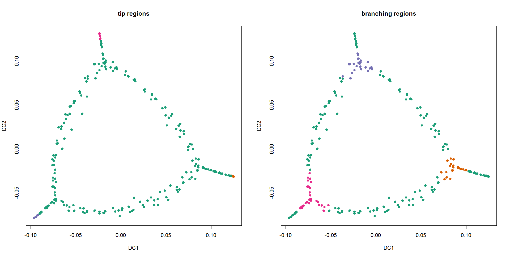

```{r setup, include=FALSE}
knitr::opts_chunk$set(echo = TRUE)
library(kbranches)
```

## Introduction

This document provides some basic use cases for the kbranches package. The main idea behind the K-Branches method is to identify regions of interest (branching regions and tips) in differentiation trajectories of single cells. So far, K-Branches is intended to be used on the diffusion map representation of the data, so the user should either provide the data in diffusion map space or use the [destiny](http://bioconductor.org/packages/release/bioc/html/destiny.html) package perform diffusion map dimensionality reduction.

If you use this package for your work, please cite the **corresponding paper**: [Model-based branching point detection in single-cell data by K-Branches clustering, doi: https://doi.org/10.1101/094532 ](https://doi.org/10.1101/094532)

## Installation instructions
First, you should install `destiny`, which can be used to compute Diffusion Map dimensionality reduction. Then you can install `kbranches` and its other dependencies.
```{r installation, eval=FALSE}
#First install destiny
devtools::install_github('theislab/destiny')

#Then install kbranches
devtools::install_github('theislab/kbranches')
```

## Global K-Branches

The purpose of this method is to cluster all data points into a set of K halflines (branches) with a common center. The number of branches K is a user defined hyperparameter. Moreover, the method can compute the GAP statistic, as well as a modified version of the GAP statistic that measures the dispersion around the branches, as opposed to the original GAP that measures the dispersion around cluster means. The main purpose of this method is to be used locally to identify branching and tip regions in the data. However, it is useful to develop an understanding of how the clustering method works. To this extent, the following example is presented.

The code also provides and example of how to use the destiny package to calculate the diffusion map representation of the data.
The sigma hyperparameter of destiny::DiffusionMap a user specified hyperparameter, but the package is also able to estimate an appropriate value.
```{r kbranches.global, eval=FALSE}
library(kbranches)
set.seed(1)
pal=RColorBrewer::brewer.pal(8,"Dark2")#change the color palette

#load the data
raw_dat=scdata.3lines.simulated6genes_subsampled

#perform diffusion map dimensionality reduction
dmap=destiny::DiffusionMap(raw_dat,sigma = 1000)

#keep the first 2 diffusion components
input_dat=destiny::as.data.frame(dmap)[,1:2]

#cluster into a K-Star with K=3
clust=kbranches.global(input_dat,Kappa=3)

#plot cluster assignments
plot(input_dat,col=pal[clust$cluster],pch=21,bg=pal[clust$cluster])
```


 
<!-- # ```{r kbranch.global plot} -->
<!-- # #(dmap, 1:2, col = clust$cluster, pch = 20) -->
<!-- # #or plot(input_dat, col = ...) -->
<!-- # plot(input_dat[,1:2], col = clust$cluster, pch = 20) -->
<!-- # ``` -->

## Local K-Branches

The local version of K-Branches applies the method introduced above, locally in the neighbourhood of each data point.
That is, `kbranches.global` is run for $K=1,2,3$ while keeping the center fixed at each data point. Additionally, the original and modified GAP statistics are calculated for each clustering, in order to perform model selection at a subsequent step.
In terms of hyperparameters, *S_neib* is perhaps the most important, as it controls the neighbourhood size. If it is not provided, it is estimated automatically. In any case, if *S_GUI_helper* is set to *TRUE*, a graphical user interface will show up that will visualize the neighbourhood for different values of *S_neib* and helps the user decide whether to accept the suggested value, or fine tune it.

Another argument to be considered is *parallel_ncores*, which determines the number of CPUs used for parallel execution. By default *parallel_ncores* = NULL, which means that all available CPUs are used (minus 1 for system stability). During parallel execution, the progress of the algorithm is printed in the file specified by the *logfile* argument. By default, the logfile is called "log.kbranches.local.txt" and is located in the working directory.

### A minimal example of local K-Branches

Here we present a minimal example where *kbranches.local* runs on a toy dataset. Default values are used for all parameters. The input data is already in diffusion map space, so no preprocessing by destiny takes place. Nonetheless, an illustration of how to get the diffusion map representation of a dataset, was presented in the example of the previous section. 

```{r kbranches.local.run, eval=FALSE}
library(kbranches)
set.seed(1)
pal=RColorBrewer::brewer.pal(8,"Dark2")#change the color palette

#load the data, already in diffusion map format
data(scdata.loop.dmap)
input_dat <- scdata.loop.dmap[, 1:2] #keep the first 2 diffusion components

#compute the distances among all samples
Dmat <- compute_all_distances(input_dat)

#perform local clustering to identify regions
#Since the neighbourhood size S_neib is NULL (default), it will be estimated from the data
#All available CPU cores will be utilized.
res <- kbranches.local(input_dat = input_dat, Dmat = Dmat)
```

At this point, kbranches.local has evaluated all data points and calculated the corresponding GAP statistics. Next, we will focus on model selection, while performing label filtering. To be precise, in the interest of smaller execution time we only use a few bootstrap datasets to calculate the GAP statistic (using the default settings). This may lead to *a few* data points getting the wrong label (tip region/branching region). However, since these false positive data points are *few* and appear *randomly out of place*, we can correct this by filtering the label of each data point based on the label of it's neighbours. Let us consider as *negative* the data points belonging to intermediate regions and *positive* all data points that belong to either tip or intermediate regions. The label filtering process is as follows: each *positive* data point can keep it's label if a minimum number (given by the *smoothing_region_thresh* argument) of it's total (given by the *smoothing_region* argument) neighbours share the same label with the data point in question. In plain words, all tip region data points can keep their label if at least 5 of their 10 neighbours (numbers selected at random for this example) are tip region cells. Otherwise their label is set to *intermediate region*. If any of *smoothing_region_thresh* or *smoothing_region* is set to `NULL`, a GUI will pop-up to aid in their selection.

After identifying all cells belonging to tip and branching regions, the method proceeds to estimate the exact number of tip and branching regions and assign each tip data point to a specific tip region and each braching region data point to a specific branching region. The original GAP statistic is used for this purpose, which might overestimate the number of clusters in some cases. To this extent, the `identify_regions` function has a *nclust* argument which fixed the number of clusters (tips/branching regions) to a fixed user specified number.

```{r kbranches.local.filter, eval=FALSE}
#filter tip region cells
tips <- identify_regions(input_dat = input_dat, gap_scores = res$gap_scores,
                         Dist = Dmat,
                         smoothing_region = 5, smoothing_region_thresh = 5,
                         mode = 'tip')

#filter branching region cells
branch_reg <- identify_regions(input_dat = input_dat, gap_scores = res$gap_scores,
                               Dist = Dmat,
                               smoothing_region = 10, smoothing_region_thresh = 10,
                               mode='branch')

#set up a grid for the plots
dev.new();par(mfrow=c(1,2))

#plot the separate tips
plot(input_dat, pch=21, col = pal[tips$cluster + 1], bg = pal[tips$cluster + 1],
     main='tip regions')


#plot the branching_region(s), in this example we only have one branching region
plot(input_dat, pch = 21, col = pal[branch_reg$cluster + 1], bg = pal[branch_reg$cluster + 1],
     main = 'branching regions')

```




<!--  -->
